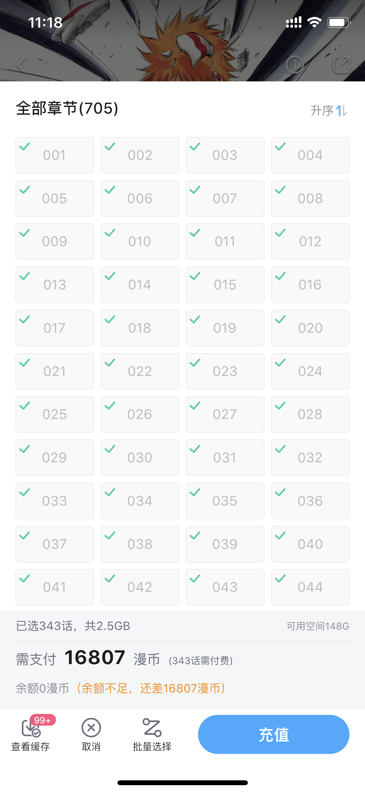
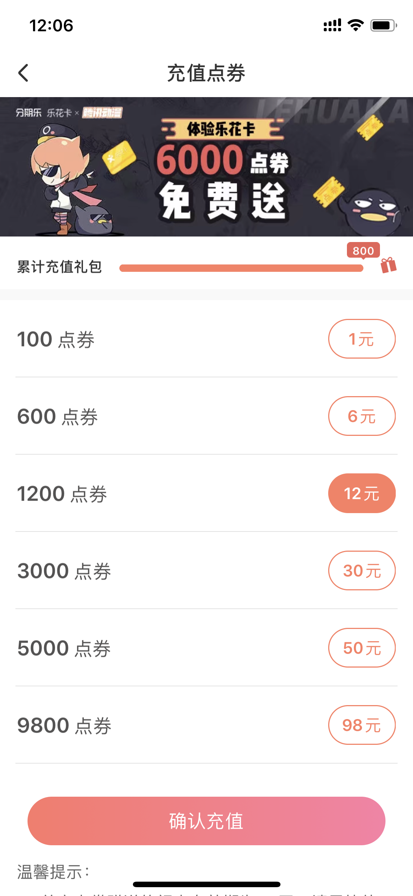
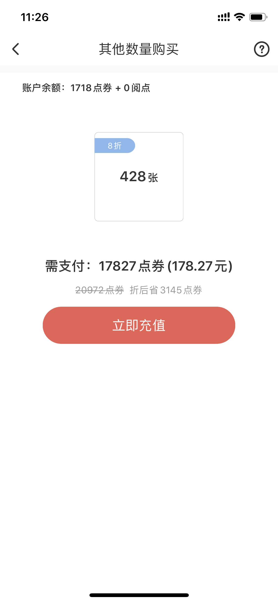

# manga-crawl

> 这是一个漫画爬虫

## 使用

```js
// 安装
npm i
// 下载 死神 Bleach
npm run bleach

// 下好的漫画在 dist 目录下，按章节分类
// 现阶段没有失败重下等等。。
// 而且我只写了 死神 的，后面等我工作不用 007 的时候再补其他的吧
// 能不能下完取决与你的人品 和 网速
// 不行就重头再来吧 ~哈哈
```

## 因

对我来讲看漫画是刚需

平时坐地铁等电梯吃午饭等各种无聊的时刻都需要看漫画打发时间

然而，各种App上都是超贵的付费内容

<div>
  
  
</div>
<div>
  
  
</div>

无论是B站还是腾讯，一本漫画就要一两百块。。

这让一贫如洗的我雪上加霜

网上倒是有免费的资源，但是手机不方便打开网页看，而且上面又很多傻逼广告，烦死了

本来就花流量，还要加小广告 -，-

所以想着写个脚本把图片下过来存手机里就行了，然后就有了这个爬虫

